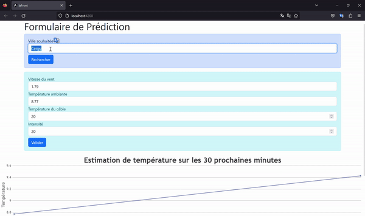

# IaFraude : pour voir le projet d'IA, checkout sur la main
Merlay Théo, Ottina Alexis, Gognoat Pierre, Sudrot Kelvin, Sajous Davenese

Le notebook se situe dans api/ressouces
# Projet Écologie : pour voir le projet d'écologie, checkout sur la branch eco
Guedda Sabrine, Merlay Théo, MOURAMBOU Réné Garcia Josias, Sajous Davenese
## Application Web de Prédiction de Température

l'application Web sur la branche éco permet aux utilisateurs de prédire la température d'un câble en fonction de différents paramètres environnementaux. Elle utilise Angular pour le front-end, FastAPI pour la fonction de prediction, et Express pour le back-end

### Technologies Utilisées

- **Front-end** :
    - Angular : Framework de développement Web.
    - Axios : Bibliothèque pour effectuer des requêtes HTTP.
    - CanvasJS : Bibliothèque pour créer des graphiques interactifs.
    - HTML/CSS : Langages de base pour la structuration et le style de la page Web.
    - nous utilsons api.openweathermap afin de récupérer les données météos d'uine ville au choix
- **Back-end** :
    - Express : Framework pour servir l'application.
- **API**
  - FASTAPI : pour la fonction de l'estimation de la trmperature

### Résultats obtenus

Nous avons essayé d'estimé la température d'Aubervilliers 30 minutes après notre test, et nous avons obtenus ces résultats

### Lancement du Back-end Express

1. Accédez au répertoire du backend Express en utilisant la commande : cd web/backend
2. Exécutez les commande suivante pour démarrer le serveur Express :npm install & npm start

### Lancement de l'API FastAPI

1. Accédez au répertoire du backend FastAPI en utilisant la commande : cd api
2. Exécutez la commande suivante pour lancer l'API : python -m uvicorn main:app --reload

### Lancement du server Front Angular
1. Accédez au répertoire du backend Express en utilisant la commande : cd web/frontend
2. Exécutez les commande suivante pour démarrer le serveur Angular :npm install & npm start

